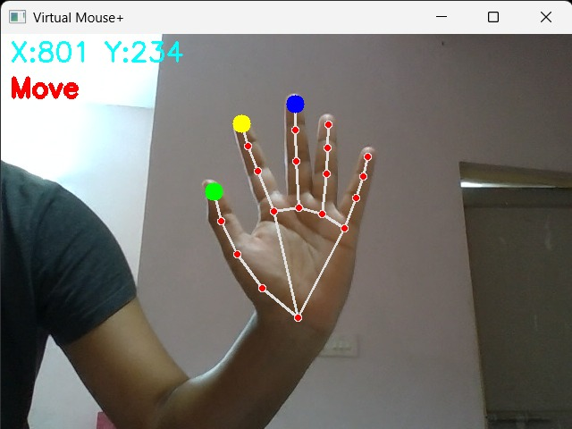
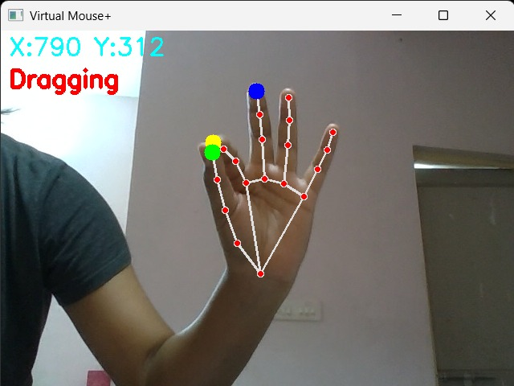
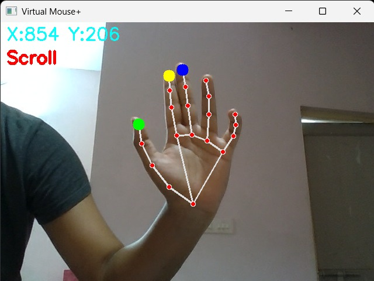

# 🖱 Gesture Controlled Virtual Mouse

This project implements a *gesture-based virtual mouse* using real-time hand tracking. Utilizing *OpenCV, **MediaPipe, and **PyAutoGUI*, it allows users to control their mouse cursor, click, drag, and scroll with simple hand gestures captured via a webcam.

## 🔧 Features

- *Move Cursor* by raising index finger
- *Drag* by pinching index and thumb fingers together
- *Scroll* by raising index and middle fingers
- *Real-time hand landmark detection*
- Visual feedback with finger-tip detection and gesture classification

---

## 📸 Demonstration

### 👉 Move Cursor


### ✌ Dragging


### 🖐 Scroll


---

## 🧰 Tools & Technologies Used

- *Python*
- *OpenCV* - for video capture and image processing
- *MediaPipe* - for hand landmark detection
- *PyAutoGUI* - for controlling mouse events

---
---

## ▶ How to Run

1. Clone the repository:
   ```bash
   git clone https://github.com/your-username/gesture-mouse.git
   cd gesture-mouse
2. Install dependencies:

bash
Copy code
pip install -r requirements.txt

3.  Run the project:

bash
Copy code
python virtual_mouse.py
